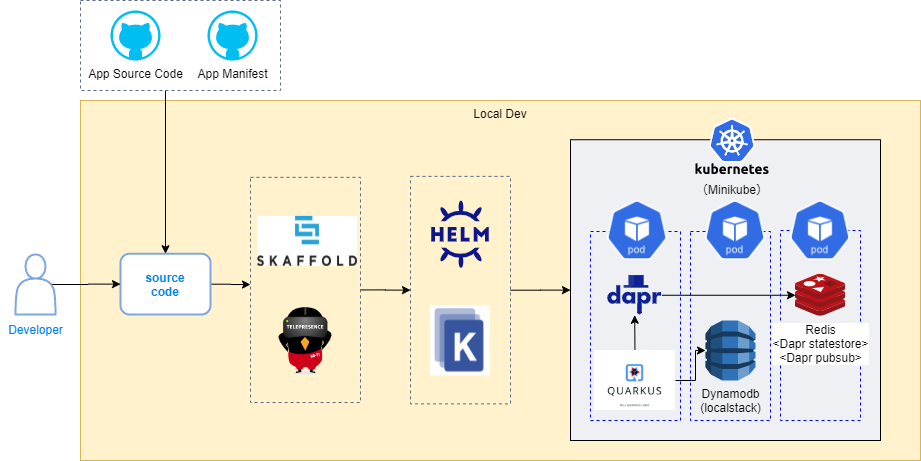

# nautible-app-ms-order project
このドキュメントには注文アプリケーションについて記載する。
アプリケーション共通の内容については[こちら](https://github.com/nautible/docs/app-common/README.md)を参照。
Quarkusアプリケーション共通の内容については[こちら](https://github.com/nautible/docs/quarkus/README.md)を参照。

## アプリケーションの主要アーキテクチャ
* [Java11](https://www.oracle.com/java/)
* [Quarkus](https://quarkus.io/)
* [Maven](https://maven.apache.org/)
* REST
* [gRPC](https://grpc.io/)
* [Kubernetes](https://kubernetes.io/)
* [Docker](https://www.docker.com/)
* [AWS](https://aws.amazon.com/)
* [dapr(statestore/pubsub)](https://dapr.io/)

## Orderサービスが利用するAWSリソースとローカル環境での代替
|  開発環境(AWS)  |  ローカル環境  | 備考 |
| ---- | ---- | ---- |
| ECR | - |  |
| Dynamodb | Localstack |  |
| Elasticache(Redis) | Redis | Dapr statemanagementで利用 |
| SNS | Redis | Dapr pubsubで利用 |
| SQS | Redis | Dapr pubsubで利用 |

## ローカル環境での開発方法
### ローカル開発イメージ図

### 事前準備
* [dockerのインストール](https://docs.docker.com/get-docker/)
* [minikubeのインストール](https://kubernetes.io/ja/docs/tasks/tools/install-minikube/)
* [kubectlのインストール](https://kubernetes.io/ja/docs/tasks/tools/install-kubectl/)（接続先の設定をminikubeにする
* [skaffoldのインストール](https://skaffold.dev/docs/install/)
* [daprのインストール(helm)](https://docs.dapr.io/getting-started/install-dapr-kubernetes/#install-with-helm-advanced)
* マニフェストファイルの配置
[nautible-app-ms-order-manifest](https://github.com/nautible/nautible-app-ms-order-manifest)をnautible-app-ms-orderプロジェクトと同一階層に配置する(git clone)。

## 注文処理とSAGAオーケストレーションパターンについて
注文処理の主要な処理は以下。受注がコーディネータとなりSAGAのオーケストレーションパターンで実装。在庫サービスはSemantic Lock Countermesureとして在庫引当の状態を保持する。Daprのpubsubコンポーネントを利用し、イベント管理を行う。
* 注文サービスが注文要求を受付、注文情報を管理（永続化）する。
* 注文サービスは、在庫サービスに在庫引当-予約の処理依頼を行う。
* 在庫サービスは、在庫引当-予約の処理結果を通知する。
* 注文サービスは、受注サービスに受注処理依頼を行う。
* 受注サービスは、受注処理の処理結果を通知する。
* 注文サービスは、在庫サービスに在庫引当-確定の処理依頼を行う。
* 在庫サービスは、在庫引当-確定の処理結果を通知する。
* 注文サービスは、注文処理を完了する（ステータス更新を行う）。
* 上記処理の途中で在庫、受注処理で問題が発生した場合は、打消し(取り消し)処理を各サービスに通知する。
### 構成イメージ

### サービス間IFの処理要求の識別について
サービス間において非同期で処理要求や処理結果のやり取りを行うため、処理要求をユニークに識別するためのIdが必要となる。
サンプル実装では以下の仕様としている。
* 処理要求元が処理要求をユニーク識別できるRequestIdを発行する。
* 処理要求元は、処理要求にRequestIdを含めたIFを行う。また、RequestIdをキーに処理状況を管理する。
* 処理要求先は、処理結果にRequestIdを含めたIFを行う。また、RequestIdをキーに処理状況を管理する。
* 処理要求元は、取り消し処理が必要になった場合は、取り消し対象のRequestIdをIFすることで取り消し処理を行う。
* 処理要求先は、受け取った取り消し対象のRequestIdに対して取り消し処理を行う。

